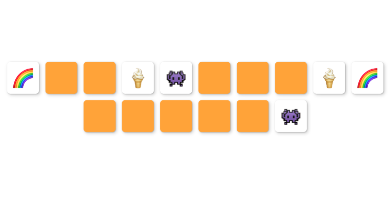

https://sandrusmb.github.io/memory-cards/

# Memory Game

Este juego de memoria es el ejercicio final de un curso online de Javascript que he realizado. El juego consta de 16 cartas en total compuestas por 8 parejas que comparten un mismo emoji. El reto es encontrar las parejas haciendo click sobre las cartas.

## El objetivo

Con este ejercicio he repasado los conceptos básicos de Javascript como: seleccionar elementos del DOM, crear funciones, eventos, utilizar métodos o añadir y quitar clases.

